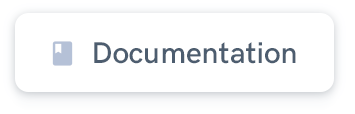

<h1 align="center" style="border-bottom: none !important; margin-bottom: 5px !important;"><a href="https://designrevision.com/downloads/shards-dashboard-lite/">Shards Dashboard UI Kit</a></h1>

  
  

A modern & free Bootstrap 4 admin dashboard template pack.

  
  
  

 

 

> ✨ **Note:** You can download the Sketch files from the official product page.

 

### Quick Start

* Install Yarn dependencies.
* Run `yarn start` to start the local development server.

 

### Built using

* [Bootstrap Datepicker by Stefan Petre and Andrew Rowls (Apache 2.0)](https://github.com/uxsolutions/bootstrap-datepicker)
* [noUiSlider by Léon Gersen (WTFPL License)](https://refreshless.com/nouislider/download/)
* [Quill](https://quilljs.com/)
* [Material Icons](http://material.io/icons)
* [FontAwesome Icons](http://fontawesome.io)

 

### Contributing

Please read [CONTRIBUTING.md](https://gist.github.com/PurpleBooth/b24679402957c63ec426) for details on our code of conduct, and the process for submitting pull requests to us.

 

### Feedback
Building better products is something I'm trying to get really good at. I’d love to hear more about how you plan on using Shards and what features you consider important in similar products. If you could spare a few minutes, please fill out [this Google Form](https://docs.google.com/forms/u/0/d/1B7_o8GLBNsTf_D99yzgY1SYCHbreHqWSCFBX9xLZmkw/edit?usp=forms_home&ths=true) to help me better understand your current context and what I could do to improve my products.

 

### Changelog

TODO